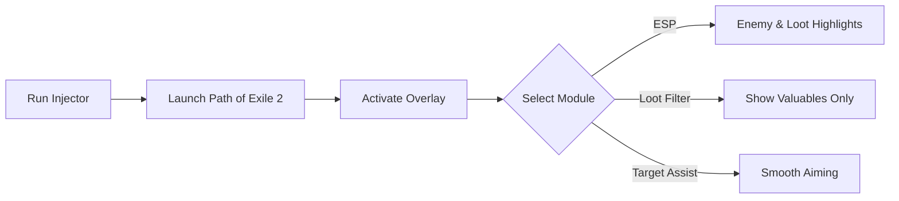

# Path of Exile 2 Cheat 🔮

The **Path of Exile 2 Cheat Software** is designed for players who want to refine their farming runs, gain tactical awareness, and test custom builds. With ESP overlays, loot filters, and real-time config options, this software helps you **train smarter and grind efficiently**.

---

## 📝 Overview

Path of Exile 2 offers a complex world of loot, enemies, and strategy. This cheat tool provides **highlighted visuals, loot radar, and customizable assists** to help you manage the chaos. Whether you’re mapping, farming, or experimenting with builds, it gives you the tools to practice and prepare more effectively.

\[!WARNING]
This software is intended for **testing, analysis, and training**. Use responsibly and back up your data.

[](#)
[](#)
[](#)
[](#)

---

## ⭐ Features

* **ESP Overlay** – See enemies, allies, and chests through walls.
* **Loot Filters** – Highlight only valuable drops like uniques, orbs, and rares.
* **Target Assist** – Smooth aim adjustments for testing ranged builds.
* **Configurable Hotkeys** – Switch functions on/off instantly.
* **Custom Injection** – Safe injection with error handling.
* **Performance Tracking** – Monitor FPS and latency while active.

---

## 🖥 Compatibility

| Platform       | Supported | Notes                |
| -------------- | --------- | -------------------- |
| Windows 10/11  | ✅         | Stable and tested    |
| Steam          | ✅         | Works with client    |
| Linux (Proton) | ⚠️        | May need extra setup |
| macOS          | ❌         | Not supported        |

\[!NOTE]
Accessibility: Colors, transparency, and font sizes in the ESP overlay can be fully customized.

---

## ⚡ Setup Guide

1. **Download** the Path of Exile 2 Cheat package.
2. Extract files into your PoE2 directory.
3. Run `Injector.exe` as administrator.
4. Launch the game and press `INSERT` to open the overlay.
5. Configure ESP and loot filters directly in the menu.

```ini
[esp]
enemy_color=red
ally_color=green
chest_color=gold

[loot]
filter=unique,orb,rare
highlight=true

[aim]
fov=75
smooth=4
```

---

## 🔄 Workflow Diagram



---

## ❓ FAQ

**Q: Will this affect my stash or economy?**
A: No, it only changes visuals and inputs in your session runtime.

**Q: Can I edit loot filters mid-game?**
A: Yes, changes update instantly in the overlay.

**Q: Does it run offline?**
A: Yes, once installed the tool does not require internet access.

**Q: Will FPS drop with ESP enabled?**
A: Very minimal—optimized for lightweight rendering.

**Q: Is it safe for future patches?**
A: Small patches won’t usually break it; big expansions may require an update.

---

## 🚀 Final Thoughts

The **Path of Exile 2 Cheat Software** combines **ESP overlays, loot filters, and aim assists** to help players **train, farm, and experiment** more effectively. With customization and reliability at its core, it’s a must-have for those who want total control of their PoE2 experience.

---

